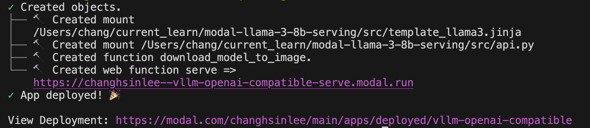

# Setup

Make sure you have signed up for a [Modal account](https://modal.com/).

Clone this repo like this or use [VSCode's command](https://code.visualstudio.com/docs/sourcecontrol/intro-to-git#_clone-a-repository-locally): 

```bash
git clone https://github.com/dsba6010-llm-applications/modal-llama-3-8b-serving.git
```

Then `cd` into your new folder `modal-llama-3-8b-serving`.

To run, I'm using Python 3.10 on a Mac.

```python
python3.10 -m venv venv
source venv/bin/activate
python -m pip install --upgrade pip
python -m pip install -r requirements.txt
```

> [!TIP]
> If you're using Windows CMD, the 2nd line will be `.\venv\Scripts\activate.bat`. 
> Alternatively, if you're using Windows PowerShell, it would be `.\venv\Scripts\activate.ps1`

To setup Modal locally:

```python
python -m modal setup
```

A browser window will open and you should select your Modal account. 

You should receive a `Web authentication finished successfully!` message.

# Serving the LLaMa3-8b-instruct

You will need to set a Bearer token (as an OPEN AI API) to authenticate as a [Modal Secret](https://modal.com/docs/guide/secrets).

Go to Modal→Your account→Dashboard→Secrets and select creating a Custom Secret. At step two, put `DSBA_LLAMA3_KEY` under `Key` and the OpenAI API key under `Value`. Click next. It will ask you to give your secret a name. Name your secret `dsba-llama3-key`.

If you're running on your own, you will need an `.env` file with `DBSA_LLAMA3_KEY=<your secret value>`. 

After supplying the secret in Modal, you should be able to run the following command with no error:

```bash
modal deploy src/api.py
```

This will then provide you a URL endpoint: <https://your-workspace-name--vllm-openai-compatible-serve.modal.run>



You can view the Swagger API doc at <https://your-workspace-name--vllm-openai-compatible-serve.modal.run/docs>


# Running inference

Make sure you have a `.env` file with your token such that:

```
DSBA_LLAMA3_KEY=<secret-token>
```

Now, you can run:

```
$ python src/client.py
🧠: Looking up available models on server at https://your-workspace-name--vllm-openai-compatible-serve.modal.run/v1/. This may trigger a boot!
🧠: Requesting completion from model /models/NousResearch/Meta-Llama-3-8B-Instruct
👉: You are a poetic assistant, skilled in writing satirical doggerel with creative flair.
👤: Compose a limerick about baboons and racoons.
🤖: There once were two creatures quite fine,
Baboons and raccoons, a curious combine,
They raided the trash cans with glee,
In the moon's silver shine,
Together they dined, a messy entwine.
```

# Run inference in Colab

Alternatively, you may use [the repo's Jupyter notebook](/notebooks/dsba6010_openai_api_prompting_with_modal.ipynb), open in Colab, setting up the API key and `BASE_URL` via Colab, then run.
